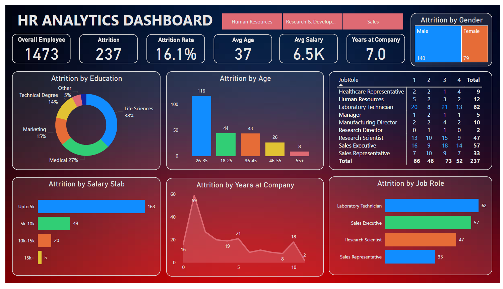

# 🧠 HR Analytics Dashboard | Power BI Project

> 📊 An interactive Power BI dashboard built to analyze employee attrition trends, helping HR professionals make data-driven decisions to improve employee retention and satisfaction.

## 🚀 Objective
To visualize and analyze HR data, identify key attrition drivers, and derive strategic insights for improving employee retention across departments like HR, R&D, and Sales.

## 📁 Dataset & Source
- Source: HR management system export (sample dataset)
- Fields include: Employee ID, Age, Education, Gender, Job Role, Salary, Years at Company, Attrition

## 🔧 Tools & Technologies
- Power BI Desktop  
- Power Query  
- DAX (Data Analysis Expressions)

## 📊 Key Metrics & KPIs

| Metric               | Value    |
|----------------------|----------|
| Total Employees      | 1,473    |
| Attrition Count      | 237      |
| Attrition Rate       | 16.1%    |
| Average Age          | 37 years |
| Average Salary       | ₹6.5K    |
| Avg. Tenure          | 7 years  |

## 📈 Visualizations Used

- ✅ Bar Chart: Attrition by Age, Job Role, Salary
- ✅ Donut Chart: Attrition by Education
- ✅ Line Chart: Years at Company vs Attrition
- ✅ Matrix: Job Role by Age Group
- ✅ Slicers: Department, Gender, Salary Slab

## 💡 Insights Derived

1. Highest attrition among 26–35 age group and salary < ₹5K.
2. Laboratory Technicians and Sales Executives show the most attrition.
3. Most employees leave after ~1 year at the company.
4. Life Sciences graduates have the highest attrition rate (38%).
5. Attrition is slightly higher among male employees.

## 🧠 DAX Measures

```DAX
Total Employees = DISTINCTCOUNT(Employee[EmployeeID])
Attrition Count = COUNTROWS(FILTER(Employee, Employee[Attrition] = "Yes"))
Attrition Rate = DIVIDE([Attrition Count], [Total Employees], 0)
Average Salary = AVERAGE(Employee[Salary])
Average Age = AVERAGE(Employee[Age])
Years at Company = AVERAGE(Employee[YearsAtCompany])
```

🔗 See [`DAX-Codes/measures.md`](./DAX-Codes/measures.md) for full list.

## 🎯 Recommendations

- Provide career paths for 26–35 age group.
- Increase salaries for high-attrition, low-paid roles.
- Enhance onboarding and first-year engagement.
- Improve flexibility and work-life balance for single employees.

## 📂 Folder Contents

| Folder/File              | Description                                  |
|--------------------------|----------------------------------------------|
| `Dashboard-Screenshots/` | Visual previews of the dashboard             |
| `PowerBI-File/`          | `.pbix` file for Power BI                    |
| `DAX-Codes/`             | All measures and formulas used               |
| `Assets/`                | Original PDF report or exports               |

## ✅ Lessons Learned

- End-to-end Power BI project setup
- Power Query data cleaning & shaping
- Creating measures using DAX
- Designing interactive dashboards with slicers & tooltips
- Extracting and communicating business insights

## 📸 Preview



## 📄 License

This project is for educational and portfolio purposes only. No sensitive or private data has been used.

## ✨ Author

Rinkal Gajera  
📧 [LinkedIn Profile](#) | 🌐 [Portfolio Website](#)